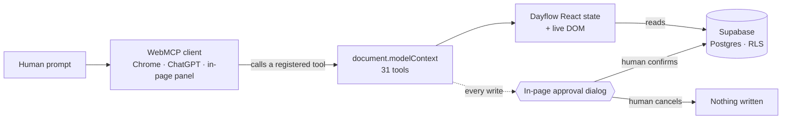

# Dayflow - Modern HR Management Platform

[](https://reactjs.org/)
[](https://www.typescriptlang.org/)
[](https://vitejs.dev/)
[](https://tailwindcss.com/)

Dayflow is a comprehensive Human Resource Management System (HRMS) built with modern web technologies. It streamlines HR operations with comprehensive employee management, attendance tracking, leave management, and payroll visibility—all in one platform.

**It is also a [WebMCP Challenge](https://webmcp.devpost.com) entry.** Dayflow registers
**31 tools** on `document.modelContext`, so a browser-native AI agent can operate the real
application alongside the human using it — and every action that touches money or records
pauses on an in-page approval dialog. Judges: start with the quickstart directly below.

---

## ⚡ Quickstart for judges

**Live URL:** <https://hrms-2-virid.vercel.app/>

| Role | Email | Password | Tools registered |
|------|-------|----------|------------------|
| Administrator | `admin@dayflow.com` | `admin123` | **31** |
| Employee | `employee@dayflow.com` | `employee123` | **11** |

Signing out and back in as the employee makes the tool list *shrink* — the admin tools are
never registered for that session, and the database refuses them independently (see
[Security model](./WEBMCP.md#security-model)).

### Seeing the tools — three ways, in order of preference

**1. Google Chrome with the WebMCP flag** (verified working on Chrome 151)

```
chrome://flags/#enable-webmcp-testing   →  Enabled  →  Relaunch
```

Open the live URL, sign in as admin, and the badge in the header turns green:
**“WebMCP live · 31 tools.”** Then open **DevTools → Application → WebMCP** to see every
registered tool with its description and invocation counter, and to invoke any of them with
JSON input. Try `list_employees` (read-only), then `decide_leave` — the write pauses on an
approval dialog in the page.

**2. ChatGPT’s in-app browser** — requires GPT-5.6 Sol or Terra (WebMCP is disabled on Luna)
and **Settings → Browser → Permissions → Enable site tools**. Availability is account-gated
by rollout; if the badge stays amber, use option 1 or 3.

**3. The in-page agent panel** — no flags, any browser. Sign in as admin and the panel appears
whenever no native agent is attached (force it with `?agentpanel=1`). It is
**bring-your-own-key**: you paste your own API key, nothing is shipped in the frontend. It calls
the same registered tools through the same approval dialogs, so the cooperative flow is
reproducible even where WebMCP itself is unavailable.

### Reproducing the demo workflows

The inputs used in the demo video are committed in [`samples/`](./samples) — drag them onto the
page, nothing is uploaded anywhere:

| File | Where it goes | What it demonstrates |
|------|---------------|----------------------|
| `work-export-aug-2026.csv` | Bonuses → import card | Client-side CSV parsing; 10 of 12 rows resolve to employees, one is unmatched and one is skipped, and every imported row lands as *claimed* rather than *verified* |
| `receipt-fig-tree-2026-08-26.txt` | Expenses → import card (drop or paste) | An itemised restaurant bill audited against Finance Policy §7 entirely in browser memory: ₹6,133 claimed → ₹1,783 reimbursable |
| `candidate-nikhil-varma.txt` | `add_employee_from_description` | Deriving employee ID, work email and department from prose, with each field labelled *stated* or *derived* in the approval dialog |
| `candidate-ananya-rao.txt` | `add_employee_from_description` | The same tool on a résumé that states its email and start date outright — most fields come back *stated*, which is the contrast case |

---

## 🚀 Features

### Core Functionality
- **📊 Dashboard** - Comprehensive overview with key metrics and analytics
- **👥 Employee Management** - Complete employee database with profiles and information
- **⏰ Attendance Tracking** - Real-time attendance monitoring and reporting
- **🏖️ Leave Management** - Leave requests, approvals, and balance tracking
- **💰 Payroll System** - Salary information and payroll management
- **⏱️ Time Off Management** - Vacation and time-off request handling

### User Experience
- **🎨 Modern UI/UX** - Clean, intuitive interface built with shadcn/ui components
- **📱 Responsive Design** - Works seamlessly on desktop, tablet, and mobile devices
- **🔐 Authentication System** - Secure login and user management
- **✏️ Profile Management** - Comprehensive user profiles with editing capabilities
- **🌙 Dark Mode Support** - Modern theming system
- **⚡ Fast Performance** - Built with Vite for lightning-fast development and build times

### Technical Features
- **🔧 Component Library** - Reusable UI components with shadcn/ui
- **📋 Form Handling** - Advanced form management with validation
- **🎯 State Management** - Efficient state handling with React Context
- **🔄 Real-time Updates** - Dynamic data updates without page refreshes
- **📊 Data Visualization** - Charts and analytics for HR insights

## 🛠️ Tech Stack

- **Frontend Framework:** React 18 with TypeScript
- **Build Tool:** Vite
- **Styling:** Tailwind CSS
- **UI Components:** shadcn/ui, Radix UI
- **Icons:** Lucide React
- **Backend:** Supabase (Postgres, Auth, Row Level Security)
- **Data Layer:** TanStack React Query (server state, caching, mutations)
- **Form Handling:** React Hook Form
- **State Management:** React Context (auth) + React Query (server data)
- **Date Handling:** date-fns
- **Package Manager:** npm/bun

## 📦 Installation

### Prerequisites
- Node.js 18+ or Bun runtime
- npm, yarn, or bun package manager

### Quick Start

1. **Clone the repository**
   ```bash
   git clone https://github.com/BLx-Ankush/HRMS-2.git
   cd HRMS-2
   ```

2. **Install dependencies**
   ```bash
   # Using npm
   npm install
   
   # Using bun (recommended)
   bun install
   ```

3. **Start the development server**
   ```bash
   # Using npm
   npm run dev
   
   # Using bun
   bun run dev
   ```

4. **Open your browser**
   Navigate to `http://localhost:8080` to view the application

## 🗄️ Backend Setup (Supabase — required for real data)

This app runs on **live Supabase data only** — there are no mock arrays or hardcoded
records in the UI. Every page (Dashboard, Employees, Attendance, Leave, Time Off,
Payroll, Salary Structure, Profile) reads and writes through React Query hooks in
`src/hooks/hrms.ts`, backed by Supabase Postgres + Auth.

> HRMS2 uses its **own dedicated Supabase project** (separate from any other HRMS
> instance) because it adds the `time_off`, `employee_salaries`, and
> `company_salary_structure` tables.

1. **Create a Supabase project** at [supabase.com](https://supabase.com) and note its
   project URL and API keys (Project Settings → API).

2. **Apply the schema.** In the Supabase SQL Editor, run these in order:
   | # | File | What it does |
   |---|------|--------------|
   | 1 | `supabase/migrations/0001_init.sql` | Tables, types, triggers, RLS policies |
   | 2 | `supabase/migrations/0002_realtime.sql` | Enables live updates so admin and employee views stay in sync |
   | 3 | `supabase/migrations/0003_contributions.sql` | `contributions` + `bonus_awards` — required for the Bonuses page |

   Skipping step 3 leaves the Bonuses page empty and four WebMCP tools with nothing
   to read.

3. **Configure environment variables.** Copy `.env.example` to `.env` and fill in both
   the frontend keys and the server-only keys (the seed script reads `.env`):
   ```bash
   cp .env.example .env
   ```
   ```env
   # Frontend — safe to expose (Vite only ships VITE_-prefixed vars to the browser)
   VITE_SUPABASE_URL="https://YOUR-ref.supabase.co"
   VITE_SUPABASE_ANON_KEY="your-anon-or-publishable-key"

   # Server-only — used ONLY by scripts/seed-users.mjs. Never prefix with VITE_.
   SUPABASE_URL="https://YOUR-ref.supabase.co"
   SUPABASE_SERVICE_ROLE_KEY="your-service-role-secret-key"
   ```
   `.env` is gitignored — never commit real keys.

4. **Create the demo auth users** (admin + employee). This must run *before* the SQL
   seed, because `seed.sql` fleshes out the profiles those users create:
   ```bash
   node --env-file=.env scripts/seed-users.mjs
   ```

5. **Seed the data.** In the SQL Editor, run these in order:
   | # | File | What it adds |
   |---|------|--------------|
   | 1 | `supabase/seed.sql` | Roster (EMP001–EMP007), attendance, leave, payroll, salary structure |
   | 2 | `supabase/seed_contributions.sql` | Scored contributions for the Bonuses leaderboard |
   | 3 | `supabase/demo_topup.sql` | EMP008–EMP013, the `company_salary_structure` row, and the travel request the expense audit links against |

   All three are additive and safe to re-run. `demo_topup.sql` is what makes the
   demo inputs in [`samples/`](./samples) reproduce: without it half the rows in
   the work-export CSV match nobody, the Company salary tab reads zero, and
   `propose_salary_structure` has no employee lacking a structure to propose one for.

6. **Run the app** (`npm run dev`) and sign in with the demo accounts below.

## 🌐 Live Demo

### Deployment
The application is deployed and live on **Vercel** for easy access and testing.

**🔗 Live URL:** [https://hrms-2-virid.vercel.app/](https://hrms-2-virid.vercel.app/)

### Demo Accounts
We've created demo accounts for you to explore all features without setting up your own data:

#### 👨‍💼 Admin Access
- **Role:** Administrator
- **Access:** Full system access including employee management, payroll, and admin settings
- **Features:** Complete HR dashboard, analytics, and administrative controls
- **Email|Password:** admin@dayflow.com | admin123
  
#### 👤 Employee Access  
- **Role:** Employee
- **Access:** Personal dashboard, attendance tracking, leave requests, and profile management
- **Features:** Employee self-service portal and personal HR tools
- **Email|Password:** employee@dayflow.com | employee123
  
*Demo credentials are available on the sign-in page*

### 🚀 Future Enhancements
This project is under active development! Upcoming features and improvements include:
- Advanced analytics and reporting
- Mobile app development  
- Integration with third-party HR tools
- Enhanced security features
- Multi-language support
- Advanced workflow automation

*Stay tuned for exciting updates and new features!*


## 🤖 WebMCP Agent (Cooperative Human + AI)

This app is also a **WebMCP Challenge** entry. The admin's core workflows —
onboarding and updating employees, deciding leave, verifying contributions,
splitting a bonus pool, setting a salary structure and auditing a travel claim
against the company's own expense policy — are exposed as WebMCP
tools on `document.modelContext`, so a browser-native AI agent can operate the
*real* application. Every change pauses on a human-approval dialog: **the agent
drafts, the human commits.** The three tools that touch money take no amounts at
all — they commit only the proposal already drawn on the human's screen. The
expense audit goes further: the bill it reasons over was parsed inside the tab
and never uploaded, so no server-side API could perform it at all. There's
also an in-page, bring-your-own-key agent so the flow is reproducible in any
browser with no secret shipped in the frontend.

### How the agent reaches the app



Registration is the plain imperative API — one `registerTool` call per tool, published when
the user signs in and retracted through an `AbortSignal` when they sign out:

```js
document.modelContext.registerTool({
  name: "audit_expense_claim",
  description: "Apply the company's own travel policy to the claim loaded in this tab…",
  inputSchema: { /* JSON Schema */ },
  execute: async (input) => { /* returns MCP content blocks */ },
});
```

The real call site is [`src/lib/webmcp/registry.ts`](./src/lib/webmcp/registry.ts) (it detects
`document.modelContext`, falling back to the deprecated `navigator.modelContext`, and handles
`registerTool`'s async rejection contract). Tool definitions live in
[`src/lib/webmcp/`](./src/lib/webmcp) and are composed by role in
[`src/hooks/useWebMcpTools.ts`](./src/hooks/useWebMcpTools.ts).

### The 31 tools

Capability legend: **Read** returns data · **Calculate** derives a result deterministically in
the browser · **Drive UI** moves the human's own screen · **Propose** draws a reviewable
proposal on the canvas and writes nothing · **Commit** writes, and always behind an approval
dialog.

**Registered for every signed-in user — 11 tools**

| Tool | Capability | Notes |
|------|-----------|-------|
| `get_page_context` | Read | Live in-memory page state — route, visible rows, filters, what the human is actually looking at. No server API can answer this. |
| `navigate_to` | Drive UI | Moves the human's view |
| `focus_employee` | Drive UI | Scrolls to and pulses a row |
| `filter_directory` | Drive UI | Applies directory filters |
| `get_policy` | Read | The company's written policy text |
| `get_capacity_matrix` | Read | Team capacity by department |
| `check_leave_coverage` | Calculate | Simulates a leave window for conflicts; writes nothing |
| `get_compensation` | Read | Self-scoped for employees, any employee for admins |
| `get_scoring_model` | Read | The contribution scoring weights, so the agent cites them instead of inventing them |
| `get_my_contributions` | Read | The signed-in user's own contributions |
| `log_contribution` | Commit | Logs a claim as *unverified*; cannot score itself |

**Administrator only — 20 further tools**

| Tool | Capability | Notes |
|------|-----------|-------|
| `list_employees` | Read | |
| `get_employee` | Read | |
| `list_leave_requests` | Read | |
| `add_employee` | Commit | Fully specified employee |
| `add_employee_from_description` | Commit | Derives ID, work email and department from prose; the dialog labels every field *stated* or *derived* |
| `update_employee` | Commit | |
| `decide_leave` | Commit | Approve or reject |
| `get_contribution_scores` | Read | The leaderboard |
| `review_pending_contributions` | Read | Unverified claims queue |
| `verify_contribution` | Commit | Verifying is what makes a claim score |
| `read_contribution_import` | Read | Reads the CSV parsed **in this tab**; never uploaded |
| `propose_bonus_pool` | Propose | Splits a pool by score onto the canvas |
| `get_award_shortlist` | Calculate | |
| `record_bonus_decision` | Commit | **Takes no amounts** — commits the canvas snapshot |
| `get_salary_model` | Read | PF, professional tax and the earnings split actually in force |
| `propose_salary_structure` | Propose | Full CTC breakdown onto the canvas |
| `commit_salary_structure` | Commit | **Takes no amounts** — commits the canvas snapshot |
| `read_expense_import` | Read | Reads the receipt parsed **in this tab**; never uploaded |
| `audit_expense_claim` | Calculate + Propose | Applies Finance Policy §7 line by line and marks up the human's screen |
| `record_expense_decision` | Commit | **Takes no amounts** — commits the canvas snapshot |

> 📖 **Deep Dive Documentation:** See [`WEBMCP.md`](./WEBMCP.md) for the complete architecture diagram, security model, and step-by-step evaluation scripts.

## 🎯 Usage

### Getting Started
1. **Landing Page:** Visit the home page to learn about Dayflow's features
2. **Authentication:** Sign in with demo credentials or create a new account
3. **Dashboard:** Access the main dashboard for an overview of HR metrics
4. **Navigation:** Use the sidebar to navigate between different modules

### Key Modules

#### Employee Management
- Add new employees with complete information
- View employee directory with search and filter options
- Manage employee profiles and personal details

#### Attendance System
- Clock in/out functionality
- View attendance history and reports
- Track working hours and overtime

#### Leave Management
- Submit leave requests
- Manager approval workflow
- Leave balance tracking
- Calendar view of team availability

#### Payroll & Salary
- View salary information
- Download pay slips
- Tax and benefits information
- Payroll processing tools

#### Profile Management
- Edit personal information (mobile, location)
- Manage private information (emergency contacts, etc.)
- Update skills and about section
- Upload resume and documents

## 📁 Project Structure

```
src/
├── lib/webmcp/          # ── The WebMCP layer ──
│   ├── registry.ts          # Surface detection + registerTool/AbortSignal lifecycle
│   ├── types.ts             # Tool descriptor and result types
│   ├── approval.ts          # requireApproval() — the dialog every write awaits
│   ├── canvas.ts            # In-page proposal store the commit tools read
│   ├── tools.ts             # Roster + leave tools (admin)
│   ├── canvasTools.ts       # Page context, UI driving, policy, coverage (all roles)
│   ├── bonusTools.ts        # Contribution + bonus tools
│   ├── salaryTools.ts       # Salary proposal + commit
│   ├── expenseTools.ts      # Expense import, audit, decision
│   ├── contributionScore.ts # Deterministic scoring engine
│   ├── salaryModel.ts       # Deterministic CTC breakdown
│   ├── expenseAudit.ts      # Finance Policy §7 rules engine
│   ├── importContributions.ts # Client-side CSV/TSV/JSON parser
│   ├── importExpenses.ts    # Client-side receipt + export parser
│   ├── policies.ts          # The company policy text tools quote verbatim
│   └── agentClient.ts       # In-page bring-your-own-key agent
├── hooks/
│   ├── useWebMcpTools.ts    # Composes the tool set by role (11 → 31)
│   ├── useCanvas.ts         # Subscribes components to the proposal store
│   ├── useRealtimeSync.ts   # Supabase realtime → React Query invalidation
│   └── hrms.ts              # React Query data hooks (all pages read through these)
├── components/
│   ├── AgentPanel.tsx           # BYO-key agent panel
│   ├── WebMcpStatusBadge.tsx    # Live tool count + how to enable WebMCP
│   ├── AgentApprovalDialog.tsx  # The human-commit gate
│   ├── CanvasBridge.tsx         # Lets tools drive the human's own view
│   ├── SalaryProposalPanel.tsx  # Canvas: salary proposal
│   ├── ExpenseImportPanel.tsx   # Drop or paste a bill (nothing uploaded)
│   ├── ExpenseAuditPanel.tsx    # Canvas: marked-up expense audit
│   ├── ContributionImportPanel.tsx
│   ├── BonusPlanPanel.tsx       # Canvas: bonus pool split
│   ├── CoveragePanel.tsx        # Canvas: leave coverage simulation
│   ├── layout/                  # Sidebar, navigation
│   └── ui/                      # shadcn/ui primitives
├── contexts/AuthContext.tsx  # Session + role
├── pages/                    # Dashboard, Employees, Attendance, Leave, TimeOff,
│                             # Payroll, SalaryInfo, Bonuses, Expenses, Profile,
│                             # SignIn, SignUp, Index, NotFound
├── App.tsx
└── main.tsx

samples/                  # Demo inputs — parsed in-browser, never uploaded
supabase/
├── migrations/           # 0001_init · 0002_realtime · 0003_contributions
├── seed.sql              # Roster, attendance, leave, payroll
├── seed_contributions.sql
└── demo_topup.sql        # EMP008–EMP013 + company salary structure (additive)
scripts/seed-users.mjs    # Creates the demo auth users (server-only keys)
WEBMCP.md                 # Tool reference, lifecycle, schemas, security model
```

## 🔧 Development

### Available Scripts

- `npm run dev` - Start development server
- `npm run build` - Build for production
- `npm run preview` - Preview production build
- `npm run lint` - Run ESLint

### Code Quality
- **TypeScript** - Full type safety
- **ESLint** - Code linting and formatting
- **Component Structure** - Modular, reusable components
- **Responsive Design** - Mobile-first approach

## 🎨 Customization

### Theming
The application uses Tailwind CSS with a custom design system. You can customize:
- Color schemes in `tailwind.config.ts`
- Component styles in individual component files
- Global styles in `src/index.css`

### Components
All UI components are built with shadcn/ui and can be customized:
- Modify existing components in `src/components/ui/`
- Add new components using the shadcn CLI
- Customize styling with Tailwind utilities

## 🤝 Contributing

We welcome contributions! Please follow these steps:

1. Fork the repository
2. Create a feature branch (`git checkout -b feature/amazing-feature`)
3. Commit your changes (`git commit -m 'Add amazing feature'`)
4. Push to the branch (`git push origin feature/amazing-feature`)
5. Open a Pull Request

### Development Guidelines
- Follow TypeScript best practices
- Write descriptive commit messages
- Add proper documentation for new features
- Ensure responsive design compatibility
- Test on multiple browsers

## 📄 License

This project is licensed under the MIT License - see the [LICENSE](LICENSE) file for details.

## 🙏 Acknowledgments

- [shadcn/ui](https://ui.shadcn.com/) for the beautiful UI components
- [Tailwind CSS](https://tailwindcss.com/) for the utility-first CSS framework
- [Lucide](https://lucide.dev/) for the icon set
- [Radix UI](https://www.radix-ui.com/) for accessible component primitives

## 📞 Support

If you have any questions or need help, please:
- Open an issue on GitHub
- Contact the development team
- Check the documentation

---

**Developed with ❤️ by: " ANKUSH KUMAR M "**
